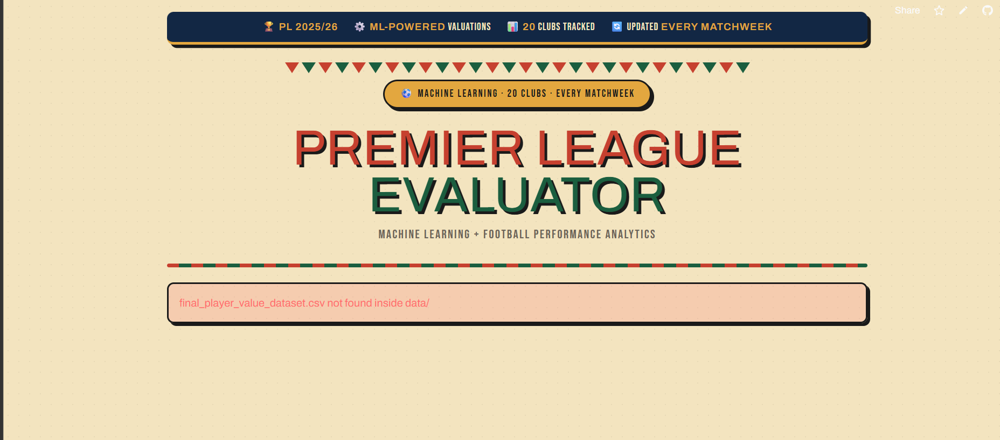
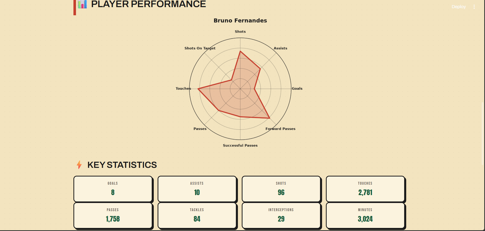
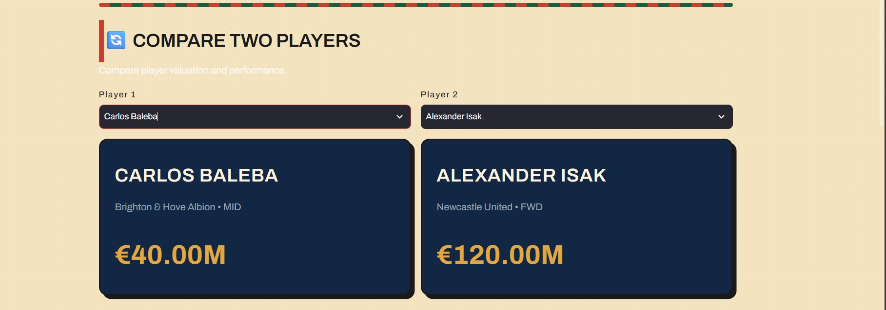
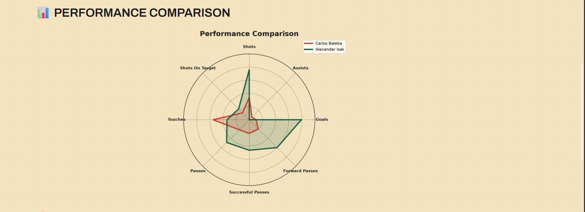
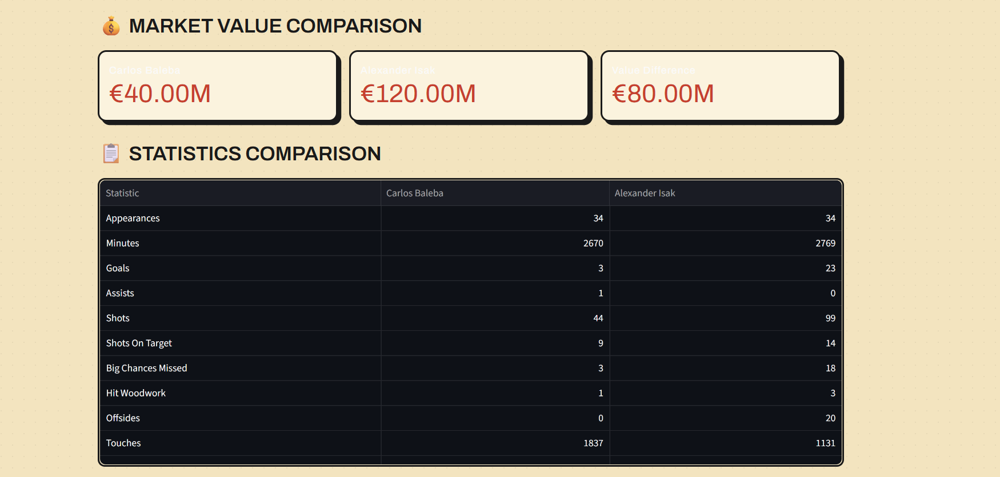
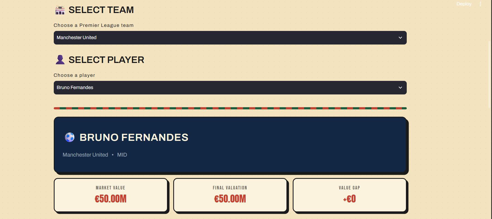

🏆 Premier League Evaluator
A Streamlit web app for exploring, analyzing, and comparing Premier League players using machine-learning-driven valuations and performance data — wrapped in a bold, retro matchday-poster UI.

[Python](https://img.shields.io/badge/python-3.9%2B-blue)
[Streamlit](https://img.shields.io/badge/streamlit-app-red)
[License](https://img.shields.io/badge/license-MIT-green)

## 🚀 Live Demo

[](https://premier-league-evaluator.streamlit.app/)

---
## ✨ Features

- **Player Analysis** — Select any team and player to view their market value, ML-estimated final valuation, value gap, key stats, and a radar chart of performance metrics.

- **Compare Players** — Pick any two players in the league and compare their valuations, performance radar charts, and full statistic breakdowns side by side.

- **Valuation Engine** — Blends real market values with a model-derived "Final Valuation," falling back gracefully between `Final Valuation`, `market_value_in_eur`, and `ML Estimated Value` depending on data availability.

- **Radar Charts** — Individual and head-to-head radar plots built with Matplotlib, normalized against league-wide maximums for each stat (goals, assists, shots, touches, passes, tackles, interceptions, progressive carries, and more).

- **Full Stats Table** — Expandable view of every numeric statistic available for a player, plus a complete side-by-side comparison table for two players.

- **Custom Themed UI** — A hand-built pop-art / matchday-poster CSS theme (Anton, Bebas Neue, Archivo fonts) applied across tabs, buttons, selectboxes, metrics, cards, and dataframes.

---

## 🖥️ Project Preview

### 🏠 Home

The main landing page introduces the Premier League Evaluator and highlights the machine-learning and football analytics focus.



---

### 👤 Player Analysis

Select a Premier League team and player to view their market value, final valuation, value gap, performance radar, and key statistics.



---

### 🔄 Player Comparison

Compare two Premier League players using their market values and performance data.



---

### 📊 Performance Comparison

The performance comparison radar chart provides a visual head-to-head comparison across attacking, passing, possession, and defensive statistics.



---

### 💰 Market Value Comparison

Compare the market values of two players and see the difference between their valuations.



---

### 📋 Statistics Comparison

View detailed statistics for both selected players side by side.


---

### 🏟️ Team & Player Selection

Choose a Premier League team and explore the players available within that squad.



---

## 🖥️ Tech Stack

- [Streamlit](https://streamlit.io/) — app framework
- [Pandas](https://pandas.pydata.org/) / [NumPy](https://numpy.org/) — data processing
- [Matplotlib](https://matplotlib.org/) — radar chart visualizations
- [Scikit-learn](https://scikit-learn.org/) — machine learning and player valuation

---

## 📁 Project Structure

```text
.
├── app.py
├── all_players_model.py
├── main.py
├── visualize.py
├── requirements.txt
│
├── data/
│   ├── final_player_value_dataset.csv
│   └── all_epl_player_valuations.csv
│
├── screenshots/
│   ├── hero.png
│   ├── home.png
│   ├── player-performance.png
│   ├── player-comparison.png
│   ├── performance-comparison.png
│   ├── market-comparison.png
│   └── team-player-selection.png
│
└── README.md
